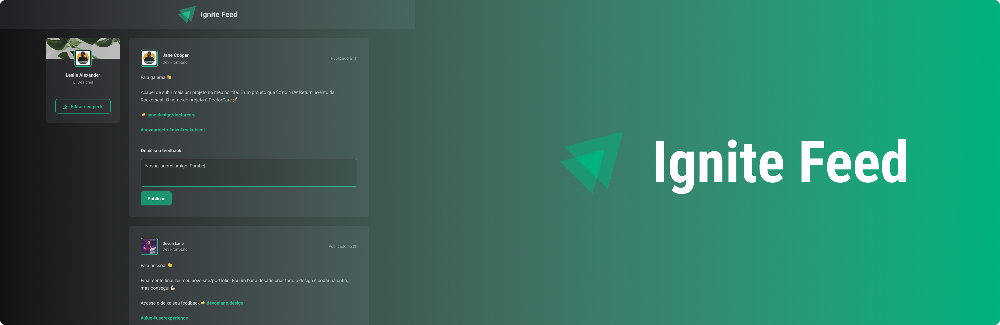
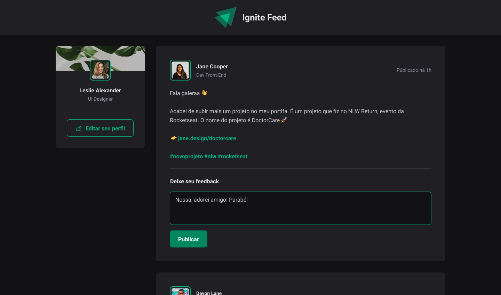
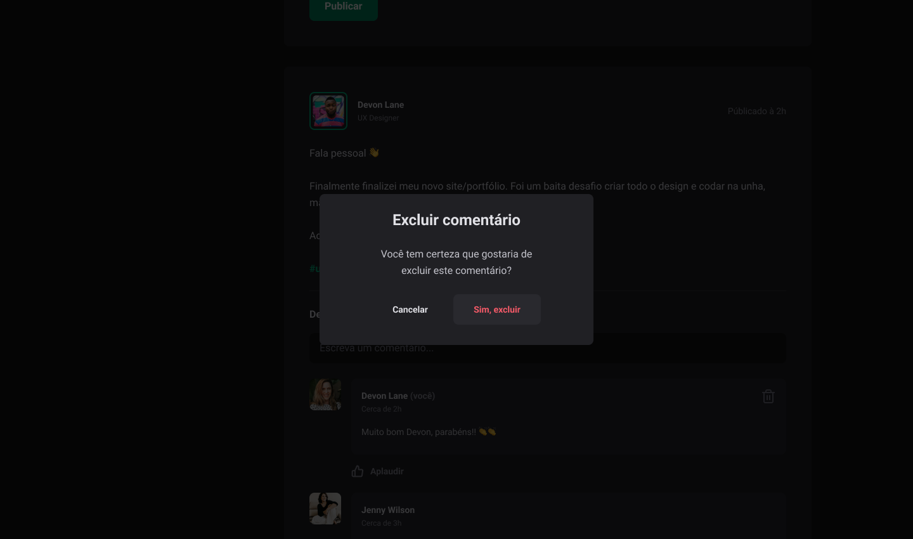

<p align="center">
  
</p>

<p align="center">
  <a href="#book-sobre-o-projeto">Sobre</a>&nbsp;&nbsp;&nbsp;|&nbsp;&nbsp;&nbsp;
  <a href="#pencil-funcionalidades">Funcionalidades</a>&nbsp;&nbsp;&nbsp;|&nbsp;&nbsp;&nbsp;
  <a href="#rocket-tecnologias">Tecnologias</a>&nbsp;&nbsp;&nbsp;|&nbsp;&nbsp;&nbsp;
  <a href="#computer-demo">Demo</a>&nbsp;&nbsp;&nbsp;|&nbsp;&nbsp;&nbsp;
  <a href="#eyes-preview">Preview</a>&nbsp;&nbsp;&nbsp;|&nbsp;&nbsp;&nbsp;
  <a href="#art-layout">Layout</a>&nbsp;&nbsp;&nbsp;|&nbsp;&nbsp;&nbsp;
  <a href="#fire-como-rodar-em-sua-maquina">Como Rodar</a>&nbsp;&nbsp;&nbsp;|&nbsp;&nbsp;&nbsp;
  <a href="#gear-como-contribuir">Contribuiçôes</a>&nbsp;&nbsp;&nbsp;|&nbsp;&nbsp;&nbsp;
    <a href="#-licença">Licença</a>
</p>

---

<h1 align="center">
    
</h1>

# :book: Sobre o projeto
O objetivo principal deste módulo é aprofundar-se nos conceitos fundamentais do React, abordando aspectos como reatividade, estilização e integração com TypeScript.

No nosso projeto, desenvolvemos uma plataforma parecida com uma rede social, apresentando uma linha do tempo dinâmica repleta de postagens interativas. Os usuários podem comentar nas postagens, mostrar que gostaram com aplausos (semelhante à função de "curtir") e até mesmo apagar os comentários que não quiserem mais.


---

# :pencil: Funcionalidades
- [x] Comentar
- [x] Apagar Comentario
- [x] Aplaudir comentario

---

# :rocket: Tecnologias
Tecnologias utilizadas para desenvolver o projeto:

- [Vite](https://vitejs.dev/)
- [ReactJS](https://pt-br.reactjs.org)
- [Typescript](https://www.typescriptlang.org/)
- [Styled-Components](https://styled-components.com/)
- [date-fns](https://date-fns.org/)
- [eslint](https://eslint.org/)

---

# :computer: Demo
Deploy na [Vercel](https://df-ignite-feed.vercel.app/)

---

# :eyes: Preview
### Web Screenshot
<div>
   <p align="center">
      
      
   </p>
</div>

---

# :art: Layout
O Layout foi desenvolvido pelo [Jonas Milan](https://www.instagram.com/jonasmilancc/), e você pode acessá-lo no [Figma](https://www.figma.com/file/daNgbDoNtOzncA1eKOb2SN/Ignite-Feed?type=design&node-id=0%3A1&mode=design&t=FjhOSXV3Fn6xi2yo-1)

---

# :fire: Como rodar em sua maquina
## Você precisa já ter instalado 
- [Git](https://git-scm.com/)
- [NodeJS](https://nodejs.org/en/)
- Package manager ([NPM](https://www.npmjs.com/) ou [Yarn](https://yarnpkg.com/))

No seu terminal:
```bash
# Abra um terminal e copie este repositório com o comando
$ git clone https://github.com/DanielFariias/ignite-feed.git

# Acesse a pasta do projeto no prompt de comando
$ cd ignite-feed

# Instale as dependências
yarn install
ou
$ npm install

# Rode o aplicação
$ yarn dev
ou
$ npm run dev

# Acesse http://localhost:5173 no seu navagador.
```

---

# :gear: Como contribuir
```bash
- Faça um fork desse repositório;
- Crie uma branch com a sua feature: git checkout -b minha-feature;
- Faça commit das suas alterações: git commit -m 'feat: Minha nova feature';
- Faça push para a sua branch: git push origin minha-feature;
```
---

# 📄 Licença

Esse projeto está sob a licença MIT. Veja o arquivo [LICENSE](LICENSE) para mais detalhes.

---


```bash
> Se te ajudou, dá ⭐, vai me ajudar também. 😉
```

<p align="center">
<br>
Este projeto foi desenvolvido com ❤️ por <a href="https://github.com/DanielFariias" target="_blank">Daniel Farias</a>
</p>
